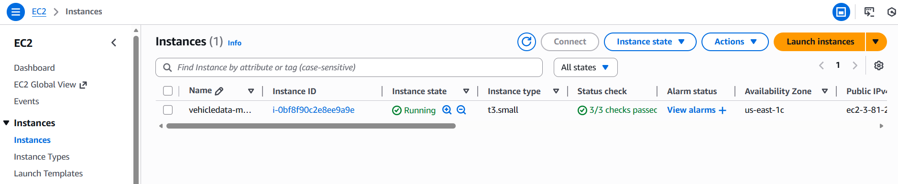

# 🚗 Vehicle Insurance MLOps — Response Prediction Project

An end-to-end **MLOps pipeline** that predicts whether a customer will respond positively to a vehicle insurance offer. The project covers the full lifecycle from raw data in MongoDB Atlas to a live, containerized web service on AWS: data ingestion, validation, transformation, model training, evaluation, artifact storage, CI/CD, and deployment.

---

## 📖 Overview

This project trains a **RandomForestClassifier** to predict customer response (Yes/No) to a vehicle insurance offer, based on features like age, vehicle age, prior insurance status, and annual premium. It is wrapped in a **FastAPI** app for real-time inference through a web form, plus an endpoint to trigger retraining on demand.

What makes it an MLOps project is everything *around* the model:

- Modular, component-based ML pipeline (ingestion → validation → transformation → training → evaluation → pusher)
- **MongoDB Atlas** as the raw data source
- Trained model artifacts versioned and pushed to **AWS S3**
- A fully automated **CI/CD pipeline** (GitHub Actions) that builds, pushes, and deploys the app
- **Docker**-based containerization
- Deployment to **AWS EC2** via a self-hosted GitHub Actions runner, with images stored in **AWS ECR**

## 🏗️ Architecture

```text
      ┌────────────────────────┐
      │   Code Push (GitHub)   │
      └────────────┬───────────┘
                    ↓
      ┌────────────────────────┐
      │  GitHub Actions CI/CD  │
      └────────────┬───────────┘
                    ↓
      ┌────────────────────────┐
      │  Data Ingestion (Mongo)│
      └────────────┬───────────┘
                    ↓
      ┌────────────────────────┐
      │    Data Validation     │
      └────────────┬───────────┘
                    ↓
      ┌────────────────────────┐
      │  Data Transformation   │
      └────────────┬───────────┘
                    ↓
      ┌────────────────────────┐
      │     Model Training     │
      │  (RandomForestClassifier)│
      └────────────┬───────────┘
                    ↓
      ┌────────────────────────┐
      │    Model Evaluation    │
      └────────────┬───────────┘
                    ↓
      ┌────────────────────────┐
      │  Model Pusher (S3)     │
      └────────────┬───────────┘
                    ↓
      ┌────────────────────────┐
      │   Docker Image Build   │
      └────────────┬───────────┘
                    ↓
      ┌────────────────────────┐
      │    Push to AWS ECR     │
      └────────────┬───────────┘
                    ↓
      ┌────────────────────────┐
      │    Deploy to AWS EC2   │
      │   (self-hosted runner) │
      └────────────┬───────────┘
                    ↓
      ┌────────────────────────┐
      │      FastAPI App       │
      │  (Serves Predictions)  │
      └─────────────────────────┘
```

The whole flow from code push to a live container running on EC2 is orchestrated by a **single GitHub Actions workflow** (`.github/workflows/`), split into a hosted `Continuous-Integration` job (build + push to ECR) and a self-hosted `Continuous-Deployment` job running directly on the EC2 target.

## ✨ Key Features

- **Component-based ML pipeline** — ingestion, validation, transformation, training, evaluation, and model pushing are each isolated, testable components with explicit config and artifact entities.
- **Cloud-native data source** — raw data lives in MongoDB Atlas, pulled via a dedicated data access layer.
- **Model training** — `RandomForestClassifier` with configurable hyperparameters (`n_estimators`, `max_depth`, `min_samples_split`, `min_samples_leaf`, `criterion`), evaluated on accuracy, F1, precision, and recall.
- **Model registry via S3** — trained model + preprocessing object are bundled and pushed to/pulled from an S3 bucket, versioned by evaluation against the previous best model.
- **Web UI + training endpoint** — a FastAPI app (`app.py`) serves a form-based prediction UI and a `/train` route to trigger the full pipeline on demand.
- **Containerized deployment** — Docker image runs the FastAPI app, deployed via a self-hosted GitHub Actions runner on EC2.
- **CI/CD automation** — on every push to `main`, GitHub Actions builds and pushes the Docker image to ECR, then pulls and runs it on the EC2 instance.

## 🧰 Tech Stack

| Category | Tools |
|---|---|
| Language | Python 3.10 |
| Data source | MongoDB Atlas |
| ML | scikit-learn (RandomForestClassifier) |
| Web framework | FastAPI, Jinja2, Uvicorn |
| Containerization | Docker |
| CI/CD | GitHub Actions (self-hosted EC2 runner) |
| Cloud | AWS EC2 (compute), AWS ECR (image registry), AWS S3 (model artifacts), AWS IAM |

## 📁 Project Structure

```
MLOPS-Project-Vehicle-Insurance/
├── .github/workflows/          # CI/CD: build/push to ECR -> deploy on EC2
├── config/                     # schema.yaml and pipeline configs
├── notebook/                   # EDA, feature engineering, MongoDB push notebooks
├── src/
│   ├── components/             # data_ingestion, data_validation, data_transformation,
│   │                           #   model_trainer, model_evaluation, model_pusher
│   ├── configuration/          # MongoDB and AWS connection setup
│   ├── data_access/            # MongoDB data access layer
│   ├── entity/                 # config_entity.py, artifact_entity.py, estimator.py, s3_estimator.py
│   ├── pipline/                # training_pipeline.py, prediction_pipeline.py
│   ├── aws_storage/             # push/pull model artifacts to/from S3
│   ├── exception/, logger/, utils/
│   └── constants/
├── static/css/                 # Web UI styling
├── templates/                  # vehicledata.html
├── app.py                      # FastAPI app entrypoint
├── demo.py                     # Connection/pipeline smoke test
├── Dockerfile
├── .dockerignore
├── setup.py / pyproject.toml   # Local package install config
├── requirements.txt
├── template.py                 # Project scaffold generator
└── LICENSE
```

## ✅ Prerequisites

- Python 3.10
- Docker
- An AWS account with access to EC2, ECR, S3, and IAM, plus configured credentials
- A MongoDB Atlas account and connection string

## ⚙️ Setup & Installation

1. **Clone the repository**
   ```bash
   git clone https://github.com/ArupaBarua/MLOPS-Project-Vehicle-Insurance.git
   cd MLOPS-Project-Vehicle-Insurance
   ```

2. **Create a virtual environment and install dependencies**
   ```bash
   conda create -n vehicle python=3.10 -y
   conda activate vehicle
   pip install -r requirements.txt
   ```

3. **Set required environment variables**
   ```bash
   export MONGODB_URL="mongodb+srv://<username>:<password>@..."
   export AWS_ACCESS_KEY_ID="your_aws_access_key"
   export AWS_SECRET_ACCESS_KEY="your_aws_secret_key"
   ```

4. **Verify setup**
   ```bash
   python demo.py
   ```

## 🚀 Usage

### Run the app locally
```bash
python app.py
```
The app will be available at `http://localhost:5000`.

### Trigger model training
Visit or curl the training route:
```
GET /train
```
Runs the full pipeline: ingestion → validation → transformation → training → evaluation → model pusher.

### Get a prediction
Visit `/` in a browser, fill in the vehicle/customer form, and submit. The prediction (`Response: Yes` / `Response: No`) renders on the same page.

### Run with Docker
```bash
docker build -t vehicle-insurance-app .
docker run -p 5000:5000 \
  -e MONGODB_URL=$MONGODB_URL \
  -e AWS_ACCESS_KEY_ID=$AWS_ACCESS_KEY_ID \
  -e AWS_SECRET_ACCESS_KEY=$AWS_SECRET_ACCESS_KEY \
  vehicle-insurance-app
```

## 🌐 API / Routes

| Route | Method | Description |
|---|---|---|
| `/` | GET | Renders the vehicle data input form |
| `/` | POST | Accepts form data, runs the prediction pipeline, renders the result |
| `/train` | GET | Triggers the full training pipeline end-to-end |

## 🔁 CI/CD Pipeline

On every push to `main`, the GitHub Actions workflow runs two jobs:

**Continuous-Integration** (GitHub-hosted runner):
1. Checks out the code
2. Configures AWS credentials
3. Logs in to Amazon ECR
4. Builds the Docker image and pushes it to ECR

**Continuous-Deployment** (self-hosted runner on EC2):
1. Checks out the code
2. Configures AWS credentials
3. Logs in to Amazon ECR
4. Pulls the latest image and runs it with `docker run`, injecting MongoDB and AWS credentials as environment variables, exposing port `5000`

## 🖥️ EC2 Deployment

The self-hosted runner is registered directly on the EC2 instance, so the `Continuous-Deployment` job executes on that machine:

1. Launch an EC2 instance and install Docker on it
2. Register the instance as a self-hosted GitHub Actions runner for this repo
3. Open port `5000` in the instance's security group
4. On a successful pipeline run, the app becomes reachable at `http://<public_ip>:5000`

## 📸 Live Deployment Evidence

This project was deployed and served live on **AWS EC2** via the CI/CD pipeline above.


*EC2 instance (`t3.small`) running the FastAPI app, all status checks passed.*

✅ [View successful deployment run](https://github.com/ArupaBarua/MLOPS-Project-Vehicle-Insurance/actions/runs/21840191193) — ECR push + EC2 deployment

The instance was stopped and deleted after evaluation to avoid ongoing AWS costs.

## 📜 License

This project is licensed under the [MIT License](LICENSE).

## 👤 Author

**Arupa Barua**
